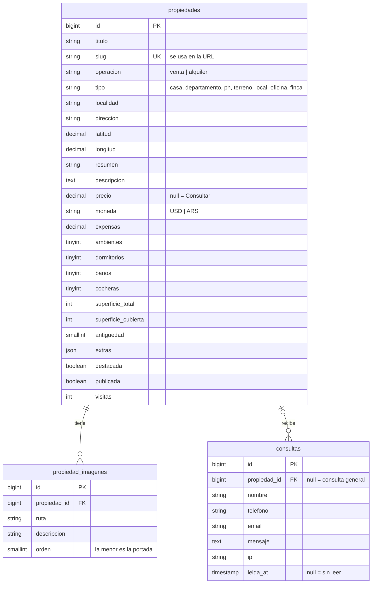

# Triángulo Inmobiliaria

Sitio web para una inmobiliaria de Mendoza, con catálogo de propiedades, formulario de consultas y panel de administración.

El proyecto empezó como un sitio estático en HTML y CSS con un formulario de contacto en PHP. Esta versión lo lleva a **Laravel 12**: las propiedades se cargan desde una base de datos, se administran desde un panel propio y las consultas quedan guardadas y se avisan por mail.

---

## Índice

1. [Funcionalidades](#funcionalidades)
2. [Tecnologías](#tecnologías)
3. [Instalación (Windows + XAMPP)](#instalación-windows--xampp)
4. [Usuario de prueba](#usuario-de-prueba)
5. [Configuración](#configuración)
6. [Estructura del proyecto](#estructura-del-proyecto)
7. [Base de datos](#base-de-datos)
8. [Rutas](#rutas)
9. [JavaScript](#javascript)
10. [Seguridad](#seguridad)
11. [Tests](#tests)
12. [Cambios respecto de la primera versión](#cambios-respecto-de-la-primera-versión)
13. [Créditos](#créditos)

---

## Funcionalidades

### Sitio público

| Página | Qué hace |
|---|---|
| **Inicio** | Buscador rápido (operación, tipo, localidad), propiedades destacadas y presentación de la inmobiliaria. |
| **Propiedades** | Listado con filtros (texto libre, operación, tipo, localidad, dormitorios, rango de precio y moneda), orden (recientes, precio, superficie) y paginación. Los filtros se mantienen al cambiar de página. |
| **Detalle** | Galería con visor a pantalla completa (teclado y gestos táctiles), características, extras, mapa de OpenStreetMap, formulario de consulta, botón de WhatsApp con mensaje armado, compartir y propiedades similares. |
| **Favoritos** | El visitante guarda propiedades con el ♥ sin registrarse (se guardan en su navegador). |
| **Nosotros / Contacto** | Información de la empresa y formulario de contacto general. |

Además:

- Diseño **responsive** (menú hamburguesa, filtros desplegables y galería adaptada a celular).
- Formularios que se envían **sin recargar la página** y con validación en el navegador y en el servidor. Si JavaScript está desactivado, siguen funcionando de la forma tradicional.
- Páginas de error propias (404, 419, 429, 500) con el diseño del sitio.
- Contador de visitas por propiedad (una por sesión y sin contar al personal).

### Panel de administración (`/admin`)

- **Resumen**: cantidad de propiedades, consultas sin leer, consultas del último mes, últimas consultas y propiedades más visitadas.
- **Propiedades**: alta, edición y baja; subida de varias fotos a la vez con vista previa, elección de portada y borrado de fotos; publicar/ocultar y destacar con un clic desde el listado; buscador y filtros.
- **Consultas**: bandeja con estado leída/no leída, búsqueda, filtro por propiedad, detalle con acceso directo para responder por mail.
- **Mi perfil**: cambio de nombre, email y contraseña (pide la contraseña actual).
- Una propiedad oculta se puede previsualizar en el sitio estando logueado.

---

## Tecnologías

- **PHP 8.2** y **Laravel 12** (Eloquent, Blade, Form Requests, Mailables).
- **MySQL / MariaDB** (la que trae XAMPP). Los tests usan SQLite en memoria.
- **HTML, CSS y JavaScript sin frameworks**: no hace falta Node ni compilar nada.
- **PHPUnit** para los tests y **Laravel Pint** para el formato del código.

---

## Instalación (Windows + XAMPP)

### Requisitos

- [XAMPP](https://www.apachefriends.org/) con PHP 8.2 o superior.
- [Composer](https://getcomposer.org/download/).
- Git (opcional, para clonar el repositorio).

### 1. Habilitar la extensión `zip` de PHP

Composer la necesita para descargar las dependencias. Abrir `C:\xampp\php\php.ini`, buscar la línea:

```ini
;extension=zip
```

y sacarle el punto y coma:

```ini
extension=zip
```

### 2. Descargar el proyecto e instalar dependencias

```bash
git clone <url-del-repositorio> Inmobiliaria-Universidad
cd Inmobiliaria-Universidad
composer install
```

### 3. Configurar el entorno

```bash
copy .env.example .env
php artisan key:generate
```

Revisar en `.env` los datos de la base de datos. Por defecto usa el usuario `root` sin contraseña de XAMPP en el puerto `3306`. **Si tu MySQL corre en el 3307 hay que cambiar `DB_PORT`.**

### 4. Crear la base de datos

Con MySQL encendido desde el panel de XAMPP, crear la base `inmobiliaria_db` desde phpMyAdmin (cotejamiento `utf8mb4_unicode_ci`) o por consola:

```bash
C:\xampp\mysql\bin\mysql.exe -u root -e "CREATE DATABASE inmobiliaria_db CHARACTER SET utf8mb4 COLLATE utf8mb4_unicode_ci;"
```

### 5. Crear las tablas y cargar los datos de ejemplo

```bash
php artisan migrate --seed
```

Esto crea las tablas, el usuario administrador y 12 propiedades de ejemplo con sus fotos (se copian a `public/uploads`).

Para borrar todo y volver a empezar:

```bash
php artisan migrate:fresh --seed
```

> Los pasos 3 a 5 también se pueden hacer juntos con `composer setup` (la base de datos tiene que existir antes).

### 6. Levantar el sitio

```bash
php artisan serve
```

Y entrar a **http://127.0.0.1:8000**.

#### Alternativa: usar el Apache de XAMPP

Si el proyecto está dentro de `C:\xampp\htdocs`, se puede abrir desde `http://localhost/Inmobiliaria-Universidad/public`. En ese caso hay que poner esa misma dirección en `APP_URL` dentro del `.env`.

---

## Usuario de prueba

| Email | Contraseña |
|---|---|
| `admin@triangulo.com` | `admin1234` |

Se define con `ADMIN_EMAIL` y `ADMIN_PASSWORD` en el `.env` **antes** de correr el seeder. Conviene cambiar la contraseña desde **Mi perfil** después del primer ingreso.

El panel está en **http://127.0.0.1:8000/admin** (también hay un link en el pie de página).

---

## Configuración

### Datos de la inmobiliaria

Nombre, dirección, teléfonos, email, WhatsApp y horario están en [`config/inmobiliaria.php`](config/inmobiliaria.php). Se usan en el header, el footer, la página de contacto y los mails, así que se cambian en un solo lugar. Algunos también se pueden definir desde el `.env`:

```ini
INMOBILIARIA_EMAIL=trianguloinmobiliaria@gmail.com
INMOBILIARIA_EMAIL_NOTIFICACIONES=trianguloinmobiliaria@gmail.com
INMOBILIARIA_WHATSAPP=5492611234567
```

### Envío de mails

Cada consulta nueva genera un mail de aviso a `INMOBILIARIA_EMAIL_NOTIFICACIONES`. Por defecto `MAIL_MAILER=log`, así que los mails **no se envían**: quedan escritos en `storage/logs/laravel.log` para poder verlos mientras se desarrolla.

Para enviarlos de verdad con Gmail (usando una [contraseña de aplicación](https://support.google.com/accounts/answer/185833)):

```ini
MAIL_MAILER=smtp
MAIL_HOST=smtp.gmail.com
MAIL_PORT=587
MAIL_USERNAME=tu-cuenta@gmail.com
MAIL_PASSWORD=la-contraseña-de-aplicación
MAIL_FROM_ADDRESS=tu-cuenta@gmail.com
```

Si el envío falla, la consulta se guarda igual y el error queda en el log: el visitante nunca ve un error por un problema del servidor de correo.

### Fotos

Las fotos subidas desde el panel se guardan en `public/uploads/propiedades/{id}/`. Se usa esa carpeta en lugar de `storage/app/public` para no depender del comando `storage:link`, que en Windows suele dar problemas o se pierde al copiar el proyecto a otra computadora. La carpeta está en el `.gitignore`.

Límites: JPG, PNG o WEBP de hasta 4 MB cada una y 15 fotos por propiedad. Si PHP rechaza archivos grandes, revisar `upload_max_filesize` y `post_max_size` en el `php.ini`.

---

## Estructura del proyecto

Solo se listan las carpetas y archivos propios del proyecto (el resto es la estructura estándar de Laravel).

```
app/
├── Http/
│   ├── Controllers/
│   │   ├── InicioController.php        Página de inicio
│   │   ├── PropiedadController.php     Listado con filtros y detalle
│   │   ├── ConsultaController.php      Página de contacto y envío de consultas
│   │   ├── FavoritoController.php      Datos (JSON) para la página de favoritos
│   │   └── Admin/
│   │       ├── AuthController.php      Login y logout
│   │       ├── DashboardController.php Resumen
│   │       ├── PropiedadController.php ABM de propiedades
│   │       ├── ImagenController.php    Portada y borrado de fotos
│   │       ├── ConsultaController.php  Bandeja de consultas
│   │       └── PerfilController.php    Datos del usuario
│   └── Requests/
│       ├── ConsultaRequest.php         Validación del formulario de consulta
│       └── PropiedadRequest.php        Validación del formulario de propiedades
├── Mail/NuevaConsulta.php              Mail de aviso de consulta nueva
└── Models/
    ├── Propiedad.php                   Filtros, orden, precio formateado, slug...
    ├── PropiedadImagen.php
    └── Consulta.php

config/inmobiliaria.php                 Datos de la empresa y del usuario admin
database/
├── migrations/                         Tablas propiedades, propiedad_imagenes y consultas
├── factories/                          Datos falsos para los tests
└── seeders/
    ├── DatabaseSeeder.php              Crea el usuario administrador
    ├── PropiedadSeeder.php             12 propiedades y 4 consultas de ejemplo
    └── imagenes/                       Fotos de las propiedades de ejemplo
lang/es/                                Mensajes de validación en español
public/
├── css/                                general.css + un archivo por página + admin.css
├── js/                                 sitio.js, favoritos.js, galeria.js, admin.js
└── img/                                Logo, imágenes de portada y "sin imagen"
resources/views/
├── layouts/app.blade.php               Header, footer y estructura común del sitio
├── partials/                           Tarjeta de propiedad, formulario, paginación...
├── propiedades/                        Listado y detalle
├── admin/                              Vistas del panel
├── errors/                             Páginas 403, 404, 419, 429 y 500
└── mail/                               Plantilla del mail
routes/web.php                          Todas las rutas
tests/Feature/                          Tests del sitio, las consultas y el panel
```

---

## Base de datos



Decisiones:

- **Borrar una propiedad** borra sus fotos (registros y archivos) pero **conserva las consultas**, que quedan como "consulta general".
- El **slug** se genera solo a partir del título y no cambia si después se edita el título, para no romper links ya compartidos.
- El **filtro por precio** solo compara propiedades de la misma moneda (no se mezclan dólares con pesos).
- Además están las tablas estándar de Laravel (`users`, `sessions`, `cache`, `jobs`, etc.).

---

## Rutas

### Públicas

| Método | URL | Descripción |
|---|---|---|
| GET | `/` | Inicio |
| GET | `/propiedades` | Listado. Acepta `q`, `operacion`, `tipo`, `localidad`, `dormitorios`, `moneda`, `precio_min`, `precio_max`, `orden`, `page` |
| GET | `/propiedades/{slug}` | Detalle |
| GET | `/nosotros` | Nosotros |
| GET | `/contacto` | Contacto (acepta `?propiedad={slug}`) |
| POST | `/contacto` | Guarda una consulta (máx. 5 por minuto por IP). Responde JSON si se pide con `Accept: application/json` |
| GET | `/gracias` | Confirmación de envío |
| GET | `/favoritos` | Favoritos del visitante |
| GET | `/favoritos/datos?ids[]=1&ids[]=2` | JSON con los datos de esas propiedades |

### Panel (requieren iniciar sesión)

| Método | URL | Descripción |
|---|---|---|
| GET / POST | `/admin/login` | Login (máx. 10 intentos por minuto) |
| POST | `/admin/logout` | Cerrar sesión |
| GET | `/admin` | Resumen |
| GET | `/admin/propiedades` | Listado |
| GET / POST | `/admin/propiedades/crear` · `/admin/propiedades` | Alta |
| GET / PUT | `/admin/propiedades/{slug}/editar` · `/admin/propiedades/{slug}` | Edición |
| DELETE | `/admin/propiedades/{slug}` | Baja |
| PATCH | `/admin/propiedades/{slug}/estado` | Publicar/ocultar o destacar |
| PATCH | `/admin/imagenes/{id}/portada` | Usar foto como portada |
| DELETE | `/admin/imagenes/{id}` | Borrar foto |
| GET | `/admin/consultas` | Bandeja (`estado`, `q`, `propiedad`) |
| GET | `/admin/consultas/{id}` | Detalle (la marca como leída) |
| PATCH | `/admin/consultas/{id}/leida` | Marcar leída / no leída |
| DELETE | `/admin/consultas/{id}` | Borrar |
| GET / PUT | `/admin/perfil` | Datos del usuario |

Se pueden ver todas con `php artisan route:list --except-vendor`.

---

## JavaScript

Todo el JavaScript es propio, sin librerías, y está en `public/js`:

| Archivo | Se carga en | Qué hace |
|---|---|---|
| `sitio.js` | Todo el sitio | Menú hamburguesa, filtros desplegables en celular, orden que se aplica solo, cierre de avisos, contador de caracteres, envío de formularios con `fetch()` (muestra los errores de validación de Laravel al lado de cada campo) y botón de compartir. |
| `favoritos.js` | Todo el sitio | Guarda los favoritos en `localStorage`, pinta los corazones, actualiza el contador del menú, sincroniza entre pestañas y arma las tarjetas de la página de favoritos. |
| `galeria.js` | Detalle | Cambio de foto con las miniaturas y visor a pantalla completa con flechas, teclado (← → Esc) y deslizamiento táctil. |
| `admin.js` | Panel | Confirmación antes de borrar, vista previa de las fotos antes de subirlas (avisa si pesan más de 4 MB), pegado de coordenadas de Google Maps en un solo campo y aviso al salir de un formulario sin guardar. |

---

## Seguridad

- **Inyección SQL**: todas las consultas pasan por Eloquent / consultas preparadas.
- **XSS**: Blade escapa todo lo que se muestra. Los textos con saltos de línea se muestran con `nl2br(e(...))`, y en JavaScript los datos se insertan con `textContent`.
- **CSRF**: todos los formularios llevan token.
- **Validación en el servidor** de todos los formularios (la del navegador es solo para comodidad).
- **Anti-spam**: límite de envíos por minuto en el formulario de consultas y un campo trampa (honeypot) invisible para bots.
- **Login**: contraseñas con bcrypt, límite de intentos, regeneración de sesión al ingresar y mensaje de error que no revela si el email existe.
- **Subida de archivos**: solo imágenes JPG/PNG/WEBP de hasta 4 MB, guardadas con nombre aleatorio.
- Las credenciales van en el `.env` (que no se sube al repositorio) y no en el código.

---

## Tests

```bash
php artisan test
```

Hay 38 tests (en `tests/Feature`) que usan una base SQLite en memoria, así que no tocan la base de datos real. Cubren:

- Carga de todas las páginas, filtros, orden, propiedades ocultas, slugs, formato de precios, contador de visitas y favoritos.
- Envío de consultas: validación, respuesta JSON, honeypot, límite de envíos, contenido del mail y escape de HTML.
- Panel: acceso sin login, login/logout, alta con fotos, validación, edición, estados, borrado de propiedades y fotos, portada, límite de fotos, bandeja de consultas y cambio de contraseña.

Para formatear el código PHP:

```bash
vendor\bin\pint
```

---

## Cambios respecto de la primera versión

| Antes | Ahora |
|---|---|
| Cada propiedad era un archivo HTML escrito a mano | Las propiedades están en la base de datos y se cargan desde el panel |
| Header y footer copiados en las 7 páginas | Un solo layout de Blade |
| `contacto.php` armaba el `INSERT` concatenando lo que llegaba por `$_POST` (inyección SQL) y mostraba los errores de MySQL al visitante | Validación, consultas preparadas, CSRF, anti-spam y mensajes amigables |
| Datos de conexión escritos en el código | Configuración en `.env` |
| Tabla `contacto` sin relación con las propiedades | Tabla `consultas`, que puede estar asociada a una propiedad y tiene estado leída/no leída |
| Las consultas solo se veían entrando a phpMyAdmin | Bandeja en el panel y aviso por mail |
| Fotos enlazadas desde otros portales inmobiliarios (se rompen si las borran) | Fotos guardadas en el propio proyecto |
| Logo y portadas en PNG de 2,4 MB en total | Las mismas imágenes optimizadas: 190 KB en total |
| No se adaptaba a celulares | Diseño responsive |
| Sin búsqueda ni filtros | Buscador, filtros, orden y paginación |
| `index.html` sin cerrar el `<body>`, links vacíos en el listado, `gracias.html` sin los estilos del sitio | Estructura corregida y más accesible (textos `alt`, atributos `aria-*`, foco en los campos con error) |

La tabla `contacto` de la versión anterior no se migra automáticamente. Si tenía datos que haga falta conservar, se pueden copiar con:

```sql
INSERT INTO consultas (nombre, telefono, email, mensaje, created_at, updated_at)
SELECT nombre, telefono, email, mensaje, NOW(), NOW() FROM contacto;
```

---

## Créditos

- Fotos de las propiedades de ejemplo: [Pexels](https://www.pexels.com/) (uso libre).
- Mapas: © colaboradores de [OpenStreetMap](https://www.openstreetmap.org/copyright).
- Logo e imágenes de portada: propios del proyecto.

Proyecto realizado para la universidad por **Nahuel Mosconi**.
